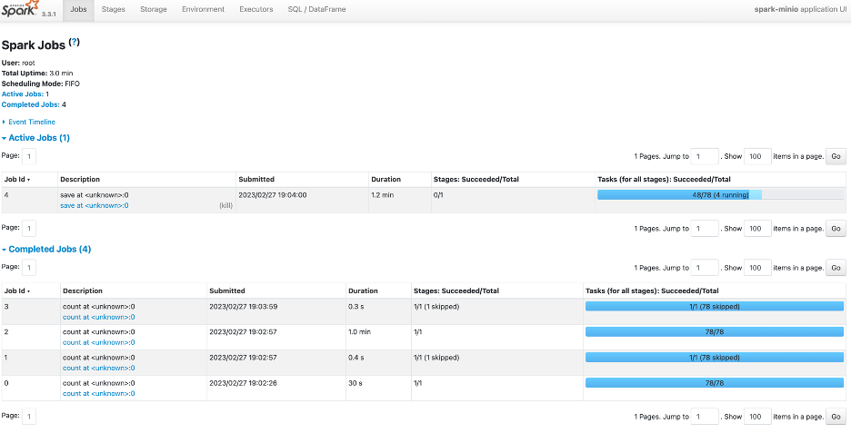

# Setup Spark Operator on Kubernetes Cluster

## Spark with Object Storage

Apache Spark is an open-source, distributed computing system used for big data processing and analytics. It is designed to handle large-scale data processing with speed, efficiency, and ease of use. Spark provides a unified analytics engine for large-scale data processing, with support for multiple languages, including Java, Scala, Python, and R.

The benefits of using Spark are numerous. Firstly, it provides a high level of parallelism, which means that it can process large amounts of data quickly and efficiently across multiple nodes in a cluster. Secondly, Spark provides a rich set of APIs for data processing, including support for SQL queries, machine learning, graph processing, and stream processing. Thirdly, Spark has a flexible and extensible architecture that allows developers to easily integrate with various data sources and other tools.

When running Spark jobs, it is crucial to use a suitable storage system to store the input and output data. Object storage systems like Minio provide a highly scalable and durable storage solution that can handle large amounts of data. Minio is an open-source object storage system that can be easily deployed on-premises or in the cloud. It is S3-compatible, which means that it can be used with a wide range of tools that support the S3 API, including Spark.

Using Minio with Spark provides several benefits over traditional Hadoop Distributed File System (HDFS) or other file-based storage systems. Firstly, object storage is highly scalable and can handle large amounts of data with ease. Secondly, it provides a flexible and cost-effective storage solution that can be easily integrated with other tools and systems. Thirdly, object storage provides a highly durable storage solution, with multiple copies of data stored across multiple nodes for redundancy and fault tolerance.

In summary, Apache Spark is a powerful tool for big data processing and analytics, and using object storage systems like Minio can provide a highly scalable, durable, and flexible storage solution for running Spark jobs.

## Why Spark on Kubernetes?
Deploying Apache Spark on Kubernetes offers several advantages over deploying it standalone. Here are some reasons why:

1. Resource management: Kubernetes provides powerful resource management capabilities that can help optimize resource utilization and minimize wastage. By deploying Spark on Kubernetes, you can take advantage of Kubernetes’ resource allocation and scheduling features to allocate resources to Spark jobs dynamically, based on their needs.
2. Scalability: Kubernetes can automatically scale the resources allocated to Spark based on the workload. This means that Spark can scale up or down depending on the amount of data it needs to process, without the need for manual intervention.
3. Fault-tolerance: Kubernetes provides built-in fault tolerance mechanisms that can help ensure the reliability of Spark clusters. If a node in the cluster fails, Kubernetes can automatically reschedule the Spark tasks to another node, ensuring that the workload is not impacted.
4. Simplified deployment: Kubernetes offers a simplified deployment model, where you can deploy Spark using a single YAML file. This file specifies the resources required for the Spark cluster, and Kubernetes automatically handles the rest.
5. Integration with other Kubernetes services: By deploying Spark on Kubernetes, you can take advantage of other Kubernetes services, such as monitoring and logging, to gain greater visibility into your Spark cluster's performance and health.

Overall, deploying Spark on Kubernetes offers greater flexibility, scalability, and fault-tolerance than deploying it standalone. This can help organizations optimize their big data processing and analytics workloads, while reducing operational overhead and costs.

## Setup Spark on Kubernetes
We will use Spark Operator to setup Spark on Kubernetes. Spark Operator is a Kubernetes controller that allows you to manage Spark applications on Kubernetes. It provides a custom resource definition (CRD) called SparkApplication, which allows you to define and run Spark applications on Kubernetes. Spark Operator also provides a web UI that allows you to easily monitor and manage Spark applications. Spark Operator is built on top of the Kubernetes Operator SDK, which is a framework for building Kubernetes operators. Spark Operator is open-source and available on [GitHub](https://github.com/GoogleCloudPlatform/spark-on-k8s-operator). It is also available as a Helm chart, which makes it easy to deploy on Kubernetes. In this tutorial, we will use the Helm chart to deploy Spark Operator on a Kubernetes cluster.

Spark Operator offers various features to simplify the management of Spark applications in Kubernetes environments. These include declarative application specification and management using custom resources, automatic submission of eligible SparkApplications, native cron support for scheduled applications, and customization of Spark pods beyond native capabilities through the mutating admission webhook.

Additionally, the tool supports automatic re-submission and restart of updated SparkAppliations, as well as retries of failed submissions with linear back-off. It also provides functionality to mount local Hadoop configuration as a Kubernetes ConfigMap and automatically stage local application dependencies to Minio via [sparkctl](https://googlecloudplatform.github.io/spark-on-k8s-operator/sparkctl/). Finally, the tool supports the collection and export of application-level metrics and driver/executor metrics to Prometheus.

### Prerequisites
To follow this tutorial, you will need:
1. A Kubernetes cluster. You can use Minikube to set up a local Kubernetes cluster on your machine.
2. Helm, the package manager for Kubernetes. You can follow this guide to install Helm on your machine.
3. A Minio server running on bare metal or kubernetes. You can follow [this](https://min.io/docs/minio/linux/operations/installation.html#install-and-deploy-minio) guide to install Minio on bare metal or [this](https://min.io/docs/minio/kubernetes/upstream/index.html) guide to install Minio on Kubernetes or you can use [play server](https://play.min.io/) for testing purposes.
4. A Minio client (mc) to access the Minio server. You can follow [this](https://docs.min.io/docs/minio-client-quickstart-guide.html) guide to install mc on your machine.

### Install Spark Operator
To install Spark Operator, you need to add the Helm repository for Spark Operator to your local Helm client. You can do this by running the following command:

```bash
helm repo add spark-operator https://googlecloudplatform.github.io/spark-on-k8s-operator
```

Once the repository is added, you can install Spark Operator using the following command:

```bash
helm install my-release spark-operator/spark-operator \
--namespace spark-operator \
--set webhook.enable=true \
--set image.repository=openlake/spark-operator \
--set image.tag=3.3.1 \
--create-namespace
```

You will see the following output:

```bash
LAST DEPLOYED: Mon Feb 27 19:48:33 2023
NAMESPACE: spark-operator
STATUS: deployed
REVISION: 1
TEST SUITE: None
```

This command installs Spark Operator in the spark-operator namespace, and enables the mutating admission webhook. The webhook is required to enable the mounting of local Hadoop configuration as a Kubernetes ConfigMap and to configure env variables that driver and executor can use. The image repository and tag are set to the image that contains the latest version of Spark Operator. You can also use the default image repository and tag by omitting the --set image.repository and --set image.tag flags, at the time of this writing the latest Spark Operator release used 3.1.1 version of Spark whereas openlake/spark-operator used the latest 3.3.1 release of Spark. You can skip the --create-namespace flag if you already have a namespace named spark-operator. This will also monitor all the spark applications in all the namespaces.

Detailed list of configuration options can be found [here](https://github.com/GoogleCloudPlatform/spark-on-k8s-operator/blob/master/charts/spark-operator-chart/README.md#values).


### Verify Spark Operator Installation
To verify that Spark Operator is installed successfully, you can run the following command:

```bash
kubectl get pods -n spark-operator
```

You will see the following output:

```bash
NAME                                        READY   STATUS    RESTARTS   AGE
my-release-spark-operator-f56c4d8c4-pr857   1/1     Running   0          14m
```

Now that we have the spark operator installed, we can deploy a Spark application or Scheduled Spark application on Kubernetes.

### Deploy a Spark Application
Let's try deploying one of the example simple spark application that comes with the spark operator. You can find the list of example applications [here](https://github.com/GoogleCloudPlatform/spark-on-k8s-operator/tree/master/examples) that calcuates Pi, we will modify the [spark Pi application](https://github.com/GoogleCloudPlatform/spark-on-k8s-operator/blob/master/examples/spark-py-pi.yaml) to use Spark 3.3.1 and run it on Kubernetes.

```yaml
apiVersion: "sparkoperator.k8s.io/v1beta2"
kind: SparkApplication
metadata:
    name: pyspark-pi
    namespace: spark-operator
spec:
    type: Python
    pythonVersion: "3"
    mode: cluster
    image: "openlake/spark-py:3.3.1"
    imagePullPolicy: Always
    mainApplicationFile: local:///opt/spark/examples/src/main/python/pi.py
    sparkVersion: "3.3.1"
    restartPolicy:
        type: OnFailure
        onFailureRetries: 3
        onFailureRetryInterval: 10
        onSubmissionFailureRetries: 5
        onSubmissionFailureRetryInterval: 20
    driver:
        cores: 1
        coreLimit: "1200m"
        memory: "512m"
        labels:
            version: 3.1.1
        serviceAccount: my-release-spark
    executor:
        cores: 1
        instances: 1
        memory: "512m"
        labels:
            version: 3.3.1
```

The above application will calculate the value of Pi using Spark on Kubernetes. You can save the above application as spark-pi.yaml and deploy it using the following command:

```bash
kubectl apply -f spark-pi.yaml
```

You will see the following output:

```bash
NAME                                           READY   STATUS      RESTARTS   AGE
my-release-spark-operator-59bccf4d94-fdrc9     1/1     Running     0          24d
my-release-spark-operator-webhook-init-jspnn   0/1     Completed   0          68d
pyspark-pi-driver                              1/1     Running     0          23s
pythonpi-b6a3e48693762e5d-exec-1               1/1     Running     0          7s
```

You can check the status of the application using the following command:

```bash
kubectl get sparkapplications -n spark-operator
```

You will see the following output:

```bash
NAME         STATUS      ATTEMPTS   START                  FINISH                 AGE
pyspark-pi   COMPLETED   1          2023-02-27T15:20:29Z   2023-02-27T15:20:59Z   10m
```

You can also check the logs of the application using the following command:

```bash
kubectl logs pyspark-pi-driver -n spark-operator
```

You will see the following output:

```bash
23/02/27 15:20:55 INFO DAGScheduler: Job 0 finished: reduce at /opt/spark/examples/src/main/python/pi.py:42, took 2.597098 s
Pi is roughly 3.137960
23/02/27 15:20:55 INFO SparkUI: Stopped Spark web UI at http://pyspark-pi-d73653869375fa87-driver-svc.spark-operator.svc:4040
23/02/27 15:20:55 INFO KubernetesClusterSchedulerBackend: Shutting down all executors
```

Now that we have the simple spark application working as expected we can try to read and write data from Minio using Spark.

### Read and Write Data from Minio using Spark

Reading and writing Data from and to Minio using Spark is very simple once we have the right dependencies and configurations in place.
In this post we will not be discussing the dependencies, to keep things simple we use the `openlake/spark-py:3.3.1` image that contains all the dependencies required to read and write data from Minio using Spark.

#### Getting Demo Data into Minio
We will be using the NYC Taxi dataset that is available on Minio. You can download the dataset from [here](https://data.cityofnewyork.us/api/views/t29m-gskq/rows.csv?accessType=DOWNLOAD) which has ~112M rows and ~10GB in size. You can use any other dataset of your choice.and upload it to Minio using the following command:

```bash
mc cp nyc-taxi-data.csv play/openlake/spark/sample-data/nyc-taxi-data.csv
```

#### Sample Python Application
Let's now read and write data from Minio using Spark. We will use the following sample python application to do that.

```python
import logging
import os

from pyspark import SparkContext
from pyspark.sql import SparkSession
from pyspark.sql.types import StructType, StructField, LongType, DoubleType, StringType

logging.basicConfig(level=logging.INFO, format="%(asctime)s - %(name)s - %(levelname)s - %(message)s")
logger = logging.getLogger("MinioSparkJob")

spark = SparkSession.builder.getOrCreate()


def load_config(spark_context: SparkContext):
    spark_context._jsc.hadoopConfiguration().set("fs.s3a.access.key", os.getenv("AWS_ACCESS_KEY_ID", "openlakeuser"))
    spark_context._jsc.hadoopConfiguration().set("fs.s3a.secret.key",
                                                 os.getenv("AWS_SECRET_ACCESS_KEY", "openlakeuser"))
    spark_context._jsc.hadoopConfiguration().set("fs.s3a.endpoint", os.getenv("ENDPOINT", "play.min.io:50000"))
    spark_context._jsc.hadoopConfiguration().set("fs.s3a.connection.ssl.enabled", "true")
    spark_context._jsc.hadoopConfiguration().set("fs.s3a.path.style.access", "true")
    spark_context._jsc.hadoopConfiguration().set("fs.s3a.attempts.maximum", "1")
    spark_context._jsc.hadoopConfiguration().set("fs.s3a.connection.establish.timeout", "5000")
    spark_context._jsc.hadoopConfiguration().set("fs.s3a.connection.timeout", "10000")


load_config(spark.sparkContext)

# Define schema for NYC Taxi Data
schema = StructType([
    StructField('VendorID', LongType(), True),
    StructField('tpep_pickup_datetime', StringType(), True),
    StructField('tpep_dropoff_datetime', StringType(), True),
    StructField('passenger_count', DoubleType(), True),
    StructField('trip_distance', DoubleType(), True),
    StructField('RatecodeID', DoubleType(), True),
    StructField('store_and_fwd_flag', StringType(), True),
    StructField('PULocationID', LongType(), True),
    StructField('DOLocationID', LongType(), True),
    StructField('payment_type', LongType(), True),
    StructField('fare_amount', DoubleType(), True),
    StructField('extra', DoubleType(), True),
    StructField('mta_tax', DoubleType(), True),
    StructField('tip_amount', DoubleType(), True),
    StructField('tolls_amount', DoubleType(), True),
    StructField('improvement_surcharge', DoubleType(), True),
    StructField('total_amount', DoubleType(), True)])

# Read CSV file from Minio
df = spark.read.option("header", "true").schema(schema).csv(
    os.getenv("INPUT_PATH", "s3a://openlake/spark/sample-data/taxi-data.csv"))
# Filter dataframe based on passenger_count greater than 6
large_passengers_df = df.filter(df.passenger_count > 6)

total_rows_count = df.count()
filtered_rows_count = large_passengers_df.count()
# File Output Committer is used to write the output to the destination (Not recommended for Production)
large_passengers_df.write.format("csv").option("header", "true").save(
    os.getenv("OUTPUT_PATH", "s3a://openlake-tmp/spark/nyc/taxis_small"))

logger.info(f"Total Rows for NYC Taxi Data: {total_rows_count}")
logger.info(f"Total Rows for Passenger Count > 6: {filtered_rows_count}")
```

The above application reads the NYC Taxi dataset from Minio and filters the rows where the passenger count is greater than 6. The filtered data is then written to Minio. You can save the above code as `main.py`

#### Building the Docker Image
We will now build the docker image that contains the above python application. You can use the following Dockerfile to build the image:

```dockerfile
FROM openlake/spark-py:3.3.1

USER root

WORKDIR /app

RUN pip3 install pyspark==3.3.1

COPY src/*.py .
```
You can build your own docker image or use the pre-build image `openlake/sparkjob-demo:3.3.1` that is available on Docker Hub.


#### Deploying the Minio Spark Application
To read and write data from Minio using Spark, you need to create a secret that contains the Minio access key and secret key. You can create the secret using the following command:

```bash
kubectl create secret generic minio-secret \
--from-literal=AWS_ACCESS_KEY_ID=openlakeuser \
--from-literal=AWS_SECRET_ACCESS_KEY=openlakeuser \
--from-literal=ENDPOINT=minio.openlake.io \                                                                                               --from-literal=AWS_REGION=us-east-1 \
--namespace spark-operator
```

You will see the following output:

```bash
secret/minio-secret created
```

Now that we have the secret created, we can deploy the spark application that reads and writes data from Minio. You can save the following application as sparkjob-minio.yaml:

```yaml
apiVersion: "sparkoperator.k8s.io/v1beta2"
kind: SparkApplication
metadata:
    name: spark-minio
    namespace: spark-operator
spec:
    type: Python
    pythonVersion: "3"
    mode: cluster
    image: "openlake/sparkjob-demo:3.3.1"
    imagePullPolicy: Always
    mainApplicationFile: local:///app/main.py
    sparkVersion: "3.3.1"
    restartPolicy:
        type: OnFailure
        onFailureRetries: 3
        onFailureRetryInterval: 10
        onSubmissionFailureRetries: 5
        onSubmissionFailureRetryInterval: 20
    driver:
        cores: 1
        memory: "1024m"
        labels:
            version: 3.3.1
        serviceAccount: my-release-spark
        env:
            -   name: AWS_REGION
                value: us-east-1
            -   name: AWS_ACCESS_KEY_ID
                value: openlakeuser
            -   name: AWS_SECRET_ACCESS_KEY
                value: openlakeuser
    executor:
        cores: 1
        instances: 3
        memory: "1024m"
        labels:
            version: 3.3.1
        env:
            -   name: INPUT_PATH
                value: "s3a://openlake/spark/sample-data/taxi-data.csv"
            -   name: OUTPUT_PATH
                value: "s3a://openlake/spark/output/taxi-data-output"
            -   name: AWS_REGION
                valueFrom:
                    secretKeyRef:
                        name: minio-secret
                        key: AWS_REGION
            -   name: AWS_ACCESS_KEY_ID
                valueFrom:
                    secretKeyRef:
                        name: minio-secret
                        key: AWS_ACCESS_KEY_ID
            -   name: AWS_SECRET_ACCESS_KEY
                valueFrom:
                    secretKeyRef:
                        name: minio-secret
                        key: AWS_SECRET_ACCESS_KEY
            -   name: ENDPOINT
                valueFrom:
                    secretKeyRef:
                        name: minio-secret
                        key: ENDPOINT
```
Above Python Spark Application YAML file contains the following configurations:

* `spec.type`: The type of the application. In this case, it is a Python application.
* `spec.pythonVersion`: The version of Python used in the application.
* `spec.mode`: The mode of the application. In this case, it is a cluster mode application.
* `spec.image`: The docker image that contains the application.
* `spec.imagePullPolicy`: The image pull policy for the docker image.
* `spec.mainApplicationFile`: The path to the main application file.
* `spec.sparkVersion`: The version of Spark used in the application.
* `spec.restartPolicy`: The restart policy for the application. In this case, the application will be restarted if it fails. The application will be restarted 3 times with a 10 seconds interval between each restart. If the application fails to submit, it will be restarted 5 times with a 20 seconds interval between each restart.
* `spec.driver`: The driver configuration for the application. In this case, we are using the `my-release-spark` service account. The driver environment variables are set to read and write data from Minio.
* `spec.executor`: The executor configuration for the application. In this case, we are using 3 executors with 1 core and 1GB of memory each. The executor environment variables are set to read and write data from Minio.


You can deploy the application using the following command:

```bash
kubectl apply -f sparkjob-minio.yaml
```

After the application is deployed, you can check the status of the application using the following command:

```bash
kubectl get sparkapplications -n spark-operator
```

You will see the following output:

```bash
NAME          STATUS    ATTEMPTS   START                  FINISH       AGE
spark-minio   RUNNING   1          2023-02-27T18:47:33Z   <no value>   4m4s
```

Once the application is completed, you can check the output data in Minio. You can use the following command to list the files in the output directory:

```bash
mc ls minio/openlake/spark/output/taxi-data-output
```

You can also check the logs of the application using the following command:

```bash
kubectl logs -f spark-minio-driver -n spark-operator
```

You will see the following output:

```bash
23/02/27 19:06:11 INFO FileFormatWriter: Finished processing stats for write job 91dee4ed-3f0f-4b5c-8260-bf99c0b662ba.
2023-02-27 19:06:11,578 - MinioSparkJob - INFO - Total Rows for NYC Taxi Data: 112234626
2023-02-27 19:06:11,578 - MinioSparkJob - INFO - Total Rows for Passenger Count > 6: 1066
2023-02-27 19:06:11,578 - py4j.clientserver - INFO - Closing down clientserver connection
23/02/27 19:06:11 INFO SparkUI: Stopped Spark web UI at http://spark-minio-b8d5c4869440db05-driver-svc.spark-operator.svc:4040
23/02/27 19:06:11 INFO KubernetesClusterSchedulerBackend: Shutting down all executors

```

There is also option for you to use the Spark UI to monitor the application. You can use the following command to port forward the Spark UI:

```bash
kubectl port-forward svc/spark-minio-ui-svc 4040:4040 -n spark-operator
```
In your browser, you can access the Spark UI using the following URL: `http://localhost:4040`

You will see the following Spark UI:



Once the application is completed, you can delete the application using the following command:

```bash
kubectl delete sparkapplications spark-minio -n spark-operator
```

Deploying a Scheduled Spark Application is almost the same as deploying a normal Spark Application. The only difference is that you need to add the `spec.schedule` field to the Spark Application YAML file and the kind is `ScheduledSparkApplication`. You can save the following application as sparkjob-minio-scheduled.yaml:

```yaml
apiVersion: "sparkoperator.k8s.io/v1beta2"
kind: ScheduledSparkApplication
metadata:
    name: spark-scheduled-minio
    namespace: spark-operator
spec:
    schedule: "@every 1h" # Run the application every hour
    concurrencyPolicy: Allow
    template:
        type: Python
        pythonVersion: "3"
        mode: cluster
        image: "openlake/sparkjob-demo:3.3.1"
        imagePullPolicy: Always
        mainApplicationFile: local:///app/main.py
        sparkVersion: "3.3.1"
        restartPolicy:
            type: OnFailure
            onFailureRetries: 3
            onFailureRetryInterval: 10
            onSubmissionFailureRetries: 5
            onSubmissionFailureRetryInterval: 20
        driver:
            cores: 1
            memory: "1024m"
            labels:
                version: 3.3.1
            serviceAccount: my-release-spark
            env:
                -   name: AWS_REGION
                    value: us-east-1
                -   name: AWS_ACCESS_KEY_ID
                    value: openlakeuser
                -   name: AWS_SECRET_ACCESS_KEY
                    value: openlakeuser
        executor:
            cores: 1
            instances: 3
            memory: "1024m"
            labels:
                version: 3.3.1
            env:
                -   name: INPUT_PATH
                    value: "s3a://openlake/spark/sample-data/taxi-data.csv"
                -   name: OUTPUT_PATH
                    value: "s3a://openlake/spark/output/taxi-data-output"
                -   name: AWS_REGION
                    valueFrom:
                        secretKeyRef:
                            name: minio-secret
                            key: AWS_REGION
                -   name: AWS_ACCESS_KEY_ID
                    valueFrom:
                        secretKeyRef:
                            name: minio-secret
                            key: AWS_ACCESS_KEY_ID
                -   name: AWS_SECRET_ACCESS_KEY
                    valueFrom:
                        secretKeyRef:
                            name: minio-secret
                            key: AWS_SECRET_ACCESS_KEY
                -   name: ENDPOINT
                    valueFrom:
                        secretKeyRef:
                            name: minio-secret
                            key: ENDPOINT
```

You can deploy and see the results of the application in the same way as the normal Spark Application. Above Spark Application will run every hour and will write the output to the same directory in Minio.

All the source code for this tutorial is available in the following GitHub repository: [openlake/spark](https://github.com/minio/openlake/tree/main/spark)
